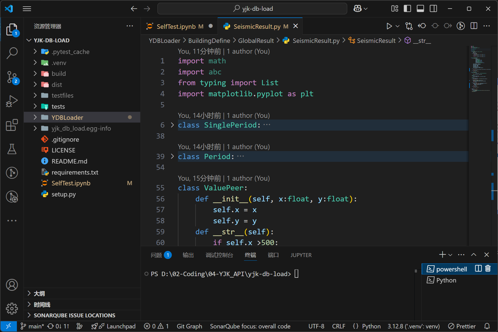
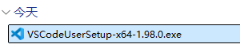
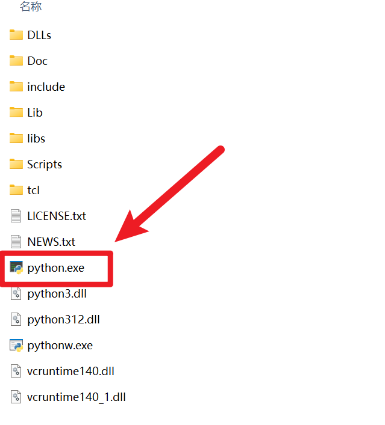
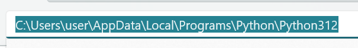
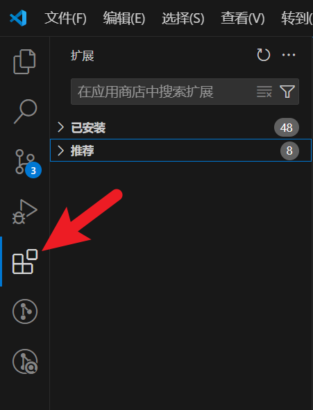
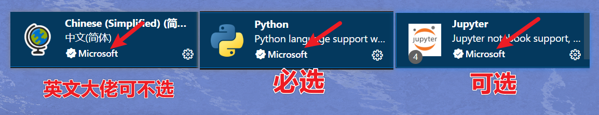
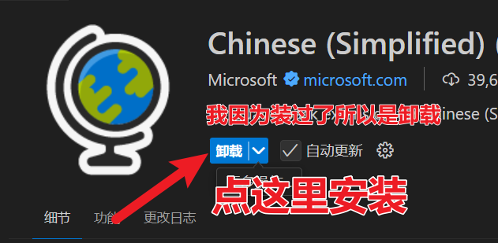
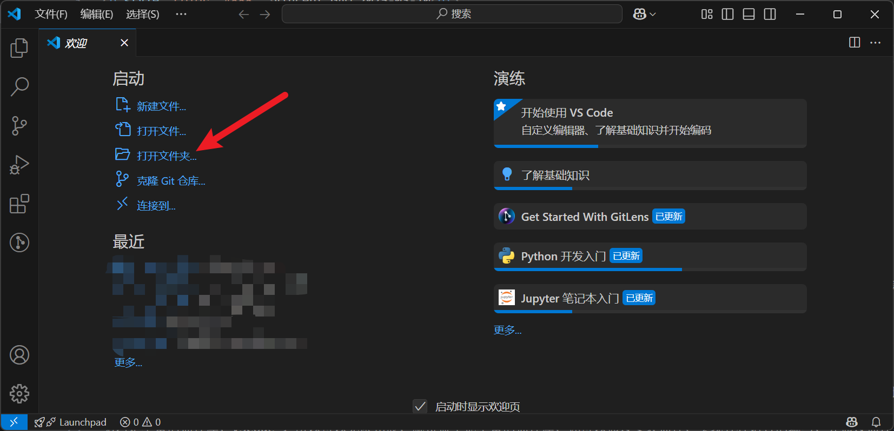
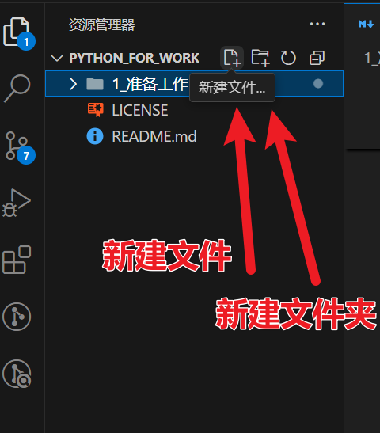

# 安装 Visual Studio Code

Vincent GAO 2025-03-10<p\>

## 什么是 VSCode

- 简单理解：一个可以运行 Python 的软件！
  

## 为什么用 VSCode

在我使用过众多编译器后，我认为 Visual Studio Code ( VSCode ) 具有以下优点及特点：

1. 免费！！！
2. 轻量！！！
3. 支持各种语言！！！
4. 插件库丰富！！！

首先是免费，PyCharm 当然具有更加优秀的对于 python 语言的支持，但是很遗憾，专业版是需要付费的，并且软件过高的复杂性，对于新手而言并不友好，增加了我们前期学习的代价。

第二是轻量，VSCode 自身，其实和电脑中的记事本没有太多的区别，左边有个`资源管理器`，点开文件以后，在右侧的编辑器中对文本进行编辑。实际下载时，只有几百 MB，和动辄几个 GB 的软件比起来，安装起来没有任何负担。

第三是多语言支持，除了 Python，他最主流的用法应该是 JavaScript 编译器（前端项目），当然还有 C++、Java，甚至 C#。当然对于我们来说，这些都不重要。

第四是丰富的插件库，VSCode 之所以可以无限拓展，就得益于他丰富的插件库，你可以通过安装插件，实现各种语言的编写，并通过插件，助力写代码的效率。

## 怎么快速安装

登录 VSCode 官网 https://code.visualstudio.com/ 点击 `Download` 即可。

双击文件安装（Mac 用户则是双击`.dmg` 文件安装）

搞定！

## 怎么运行第一行 Python 代码

### 首先你需要安装一个 Python~

是不是已经混乱了？这里我们可以稍微解释一下，编程可以理解为是用一种人类能看懂的语言，去指挥机器干活，那么这中间我们需要一个`翻译`！那么对于 python 这种语言，他需要的翻译就是一个 `python.exe`文件（当然这里只是为了便于理解，大佬勿喷）。

你可以有很多种方法获得到这个`.exe`文件，其中最简单的方式就是去[python 的官网](https://www.python.org)，或者去[下载页](https://www.python.org/downloads/)下载，如果遇到一些网络问题，还可以选择比如[阿里云镜像](https://mirrors.aliyun.com/python-release/)去选择合适的版本下载，这个步骤有太多[教程](https://blog.csdn.net/lvaolan8888/article/details/137744679)了，我就不赘述了。

安装好以后，这些文件会安静地躺在 C 盘的角角落里（可以看到这个路径还是相当隐秘的），等你用它，而这时候，VSCode 就可以开始启动啦！

### 最后安装两个插件

打开 VSCode，点击左侧的四个正方形的按钮（扩展管理/插件管理），搜索这么几个插件：

- Chinese
- Python
- Jupyter

一般来说搜到的第一个就会是，但也可以注意一下出品方是不是 Microsoft，以及下载量大不大。

## 写一行代码看下

我们前面聊过，说 VSCode 有点像一个资源管理器。你打开这个插件以后，他还不知道你要去哪里写代码，所以第一步应该是选择一个路径（推荐找一个空的文件夹）。

然后左边就会弹出来一个`资源管理器`，我们可以看到新建文件及新建文件夹的按钮，当然右键也是可以操作的。

