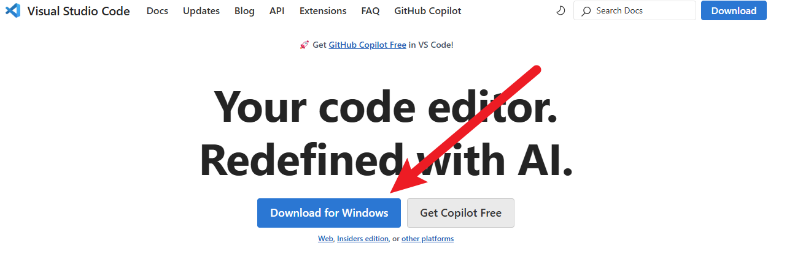

# 安装 Visual Studio Code

Vincent GAO 2025-03-10<p\>

## 什么是 VSCode

- 简单理解：一个可以运行 Python 的软件！
  

## 为什么用 VSCode

在我使用过众多编译器后，我认为 Visual Studio Code ( VSCode ) 具有以下优点及特点：

1. 免费！！！
2. 轻量！！！
3. 支持各种语言！！！
4. 插件库丰富！！！

首先是免费，PyCharm 当然具有更加优秀的对于 python 语言的支持，但是很遗憾，专业版是需要付费的，并且软件过高的复杂性，对于新手而言并不友好，增加了我们前期学习的代价。

第二是轻量，VSCode 自身，其实和电脑中的记事本没有太多的区别，左边有个`资源管理器`，点开文件以后，在右侧的编辑器中对文本进行编辑。实际下载时，只有几百 MB，和动辄几个 GB 的软件比起来，安装起来没有任何负担。

第三是多语言支持，除了 Python，他最主流的用法应该是 JavaScript 编译器（前端项目），当然还有 C++、Java，甚至 C#。当然对于我们来说，这些都不重要。

第四是丰富的插件库，VSCode 之所以可以无限拓展，就得益于他丰富的插件库，你可以通过安装插件，实现各种语言的编写，并通过插件，助力写代码的效率。

## 怎么快速安装

登录 VSCode 官网 https://code.visualstudio.com/ 点击 `Download` 即可。

双击文件安装（Mac 用户则是双击`.dmg` 文件安装）

搞定！

## 怎么运行第一行 Python 代码
