# 理解环境变量

Vincent GAO 2025-04-08<p\>

## 什么是命令行

打开`开始`菜单，搜索`cmd`，打开`命令提示符`，这时候就会弹出来一个黑框，这就是命令行。

不知道有多少人曾经用过 DOS 系统（暴露年龄？），在那个 Windows 操作系统还没有普及的年代，操作电脑，就是用这样一个黑色的命令行进行的。

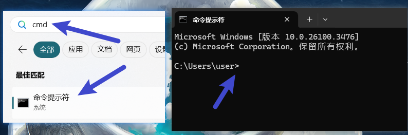

比如我在桌面放了一个 MySecrete.txt 文件，里面藏着我的秘密，他所在的文件夹路径是`C:\Users\user\Desktop`，为了打开这个文件，我就可以在 cmd 中，输入

1. `cd C:\Users\user\Desktop`
2. `MySecrete.txt`

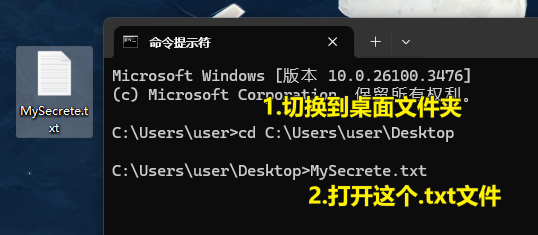

第一步是切换到桌面文件夹，可以看到第一步运行过后，`>`符号前面的路径发生了变化，代表我们目前所在的位置发生了变化。

第二步就是运行`MySecrete.txt`文件，这个效果，和我们直接用鼠标双击是一样的（可以想象，我们可以用鼠标双击这件事情，是 Windows 操作系统给提供的功能，虽然习以为常，其实这看起来还是挺困难的）

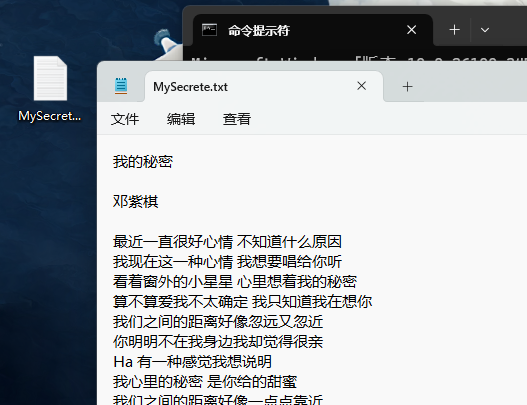

步骤二运行后，我们会发现 txt 文件被打开了，我们看到了其中的内容，哦原来我是邓紫棋粉丝。

那到这里你应该大概理解了，命令行，其实就是通过写一写文字，来操作电脑里面各种各样的事情。

## 我想运行我安装的软件

既然是邓紫棋粉丝，我想我通过命令行打开网易云音乐听歌，展现我高超的计算机技术，该怎么做呢？

首先我们右键打开桌面上网易云音乐的属性，看到，原来这个快捷方式也就是链接到了`"C:\Program Files (x86)\Netease\CloudMusic\cloudmusic.exe"`这个地方，和我打开这个文件夹去双击那个`.exe`的效果是一样的。Easy Easy~

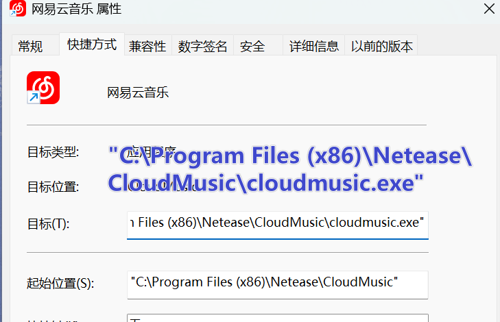

我们行云流水的写下了下面两行代码，运行了一下，发现确实！网易云音乐打开了！值得注意的是，这里加不加`.exe`后缀都是可以的，运行效果是一致的。一会儿我们也会讲为什么可以不加这个后缀。

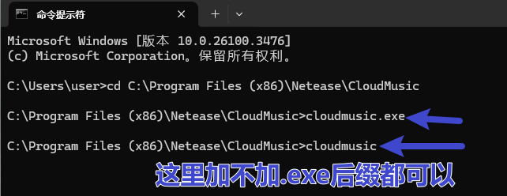

从这个歌单可以看得出，其实我是林俊杰的粉丝

## 每次都要改个路径，是不是太麻烦了？

我们发现，如果每次都要通过修改路径，才能运行某个 exe，似乎太麻烦了，我希望只要是在 cmd 的命令行，我输入`cloudmusic`就可以运行网易云音乐，异常的优雅。

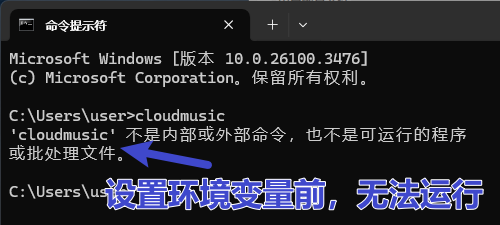

可以看到现在是不能直接运行`cloudmusic`的

这个时候你就需要`环境变量`

### 设置环境变量

找到在哪里设置是第一步，你可以在开始菜单搜索，也可以右键我的电脑，在属性里面找到它，当然不同 windows 版本可能有所差异，但是最终都会到最右边那张图。

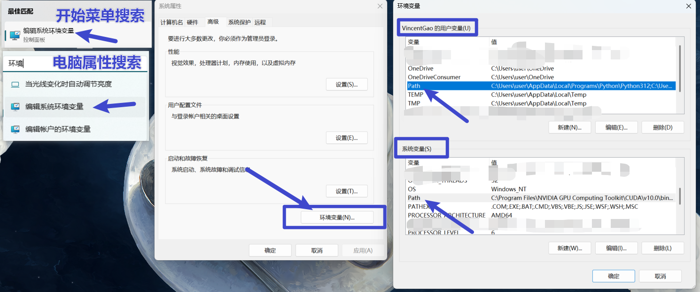

在这张图中，我们也发现了为什么可以不写.exe 就运行文件的痕迹，因为在这里，系统约定了一些后缀，是可以不用声明就可以运行的。

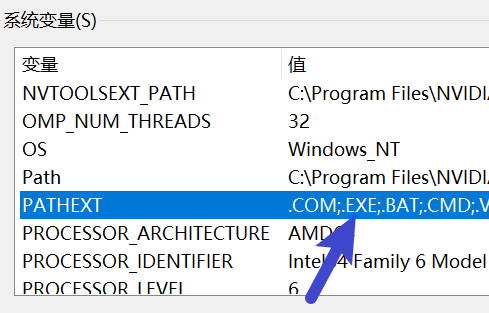

我们可以看到这里上面是用户变量，下面是系统变量，用户变量的权重要高于系统变量，对于普通的家用电脑而言，其实没有什么太大区别，我们就修改用户变量即可。

找到 Path 这一项，点击编辑->新建，并在新建的那行中，把`C:\Program Files (x86)\Netease\CloudMusic`粘贴进去，记得粘贴，自己手写很容易写错。

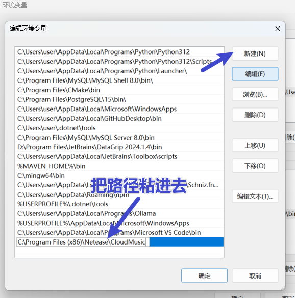

然后一路确定、保存退出来。

这时候重新打开一个新的 cmd，直接输入`cloudmusic`，就可以打开网易云了。

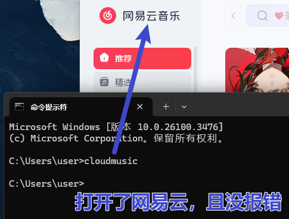

## Python 的环境变量

到现在，你应该理解了为什么我们在安装 Python 的时候，各种教程中都会让你把这个勾打上，以及他的意义是什么了。就是为了让你在任何一个文件夹中，都可以通过`python`这个命令，运行 python.exe 这个解释器。

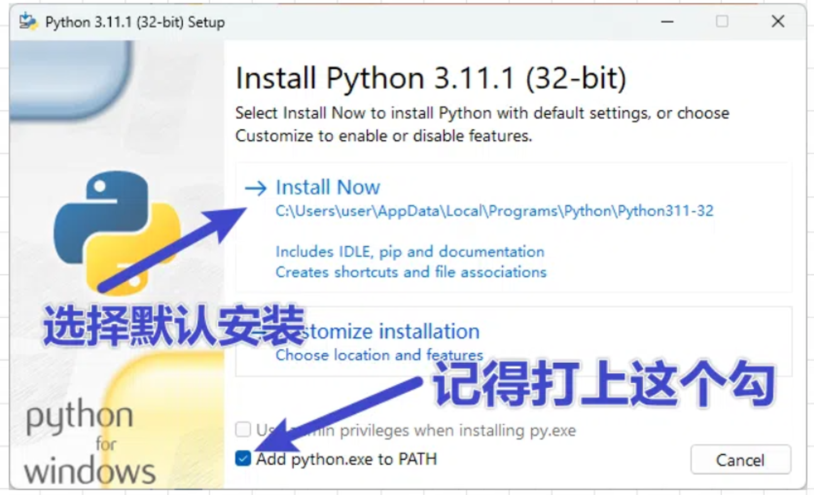
