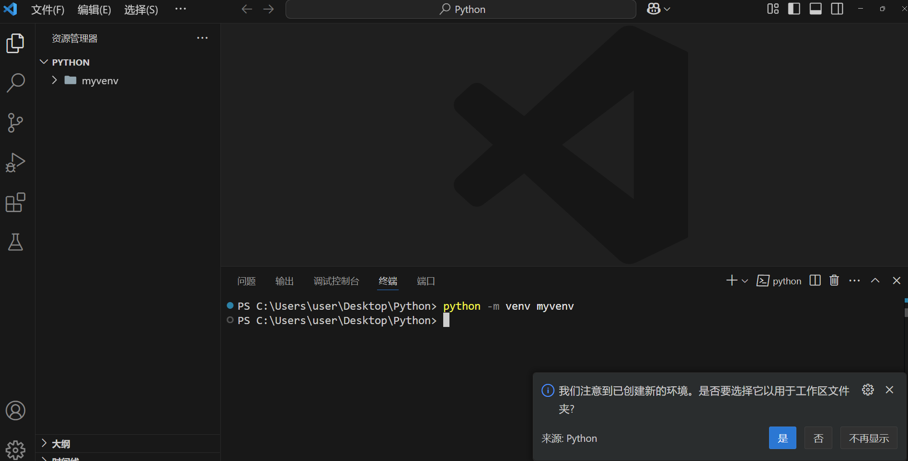
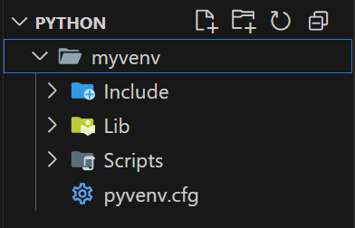
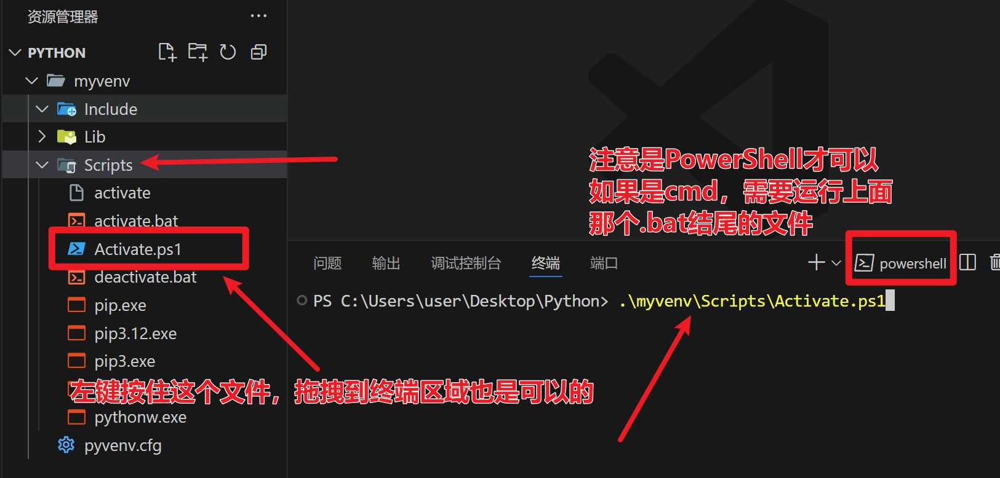
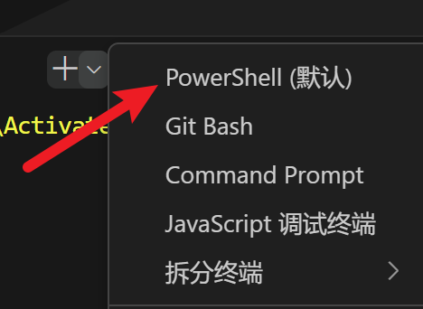
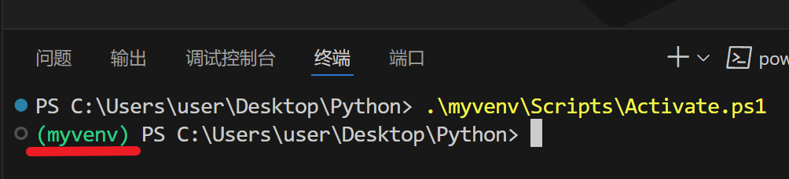
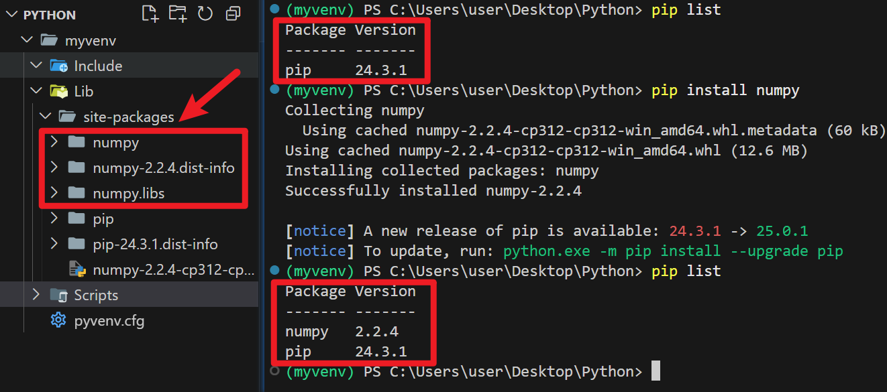
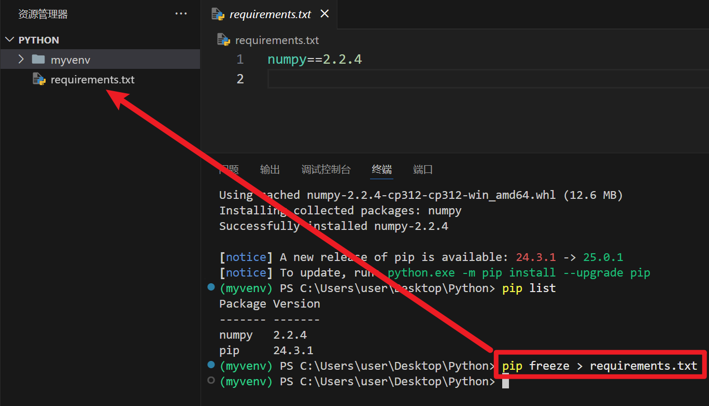
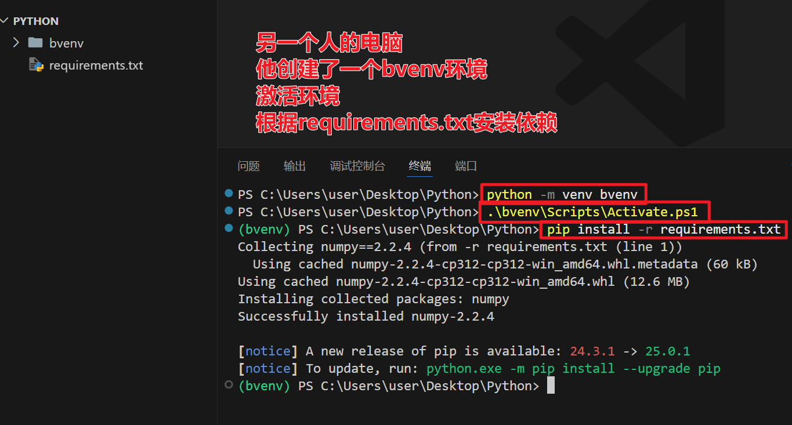

# 理解 Python 环境

<p style="color: #888;">Vincent GAO 2025-04-08<p\>

## 什么是 Python 环境
- 每一个Python环境，就是一个文件夹，它里面包括了
1. 可执行的python.exe文件
2. Script文件夹，里面包含了诸如pip等常用的命令
3. Lib文件夹，里面包含了在这个环境中，你用pip安装的各种第三方库
4. 茫茫多其他必要的文件，但是我们暂时，或者说永远不需要搞清楚他们的具体作用

- 所以我们可以看出来，当我们正常安装了Python后，他在`\AppData\Local\Programs\Python\Python313`这个文件夹中，就放了这些东西，那么这个文件夹，就可以称之为当前Python的基础环境（有时候也可以叫BASE环境，比如Anaconda就会这么叫）。


## 环境有什么作用
- 他给我们一个下载安装第三方库的位置
- 他给我们写的python代码提供了一个运行的范围

比如我们打开`cmd`，用`pip install pandas`安装了一个`pandas`，那么在这个base环境中，就会新增一些代码，藏在Script和Lib中，让你在`import pandas`的时候，能够找到所需要的代码。


## 为什么要进行环境的管理和隔离
- 在初学的时候，当然你可以不管环境的问题，所有的代码都可以基于最基础的BASE去操作
- 但是随着学习的深入，你会发现有的项目你需要用到1.0.0版本的pandas，有的项目又需要用到1.3.0版本的pandas，总不能每次切换项目的时候，都重新装一遍我需要的版本吧；尤其如果你需要和别的人合作开发代码，那么这个项目拥有一个独立的环境是非常必要的。

### 对于环境管理的最佳实践
- 我认为最佳实践就是，对于每个项目（新开一个文件夹的时候），都为它创建一个虚拟环境（virtual environment，简称venv）


在VSCode的终端中，输入如下命令，即可在当前文件夹创建一个属于该文件夹的虚拟环境

```shell
// 这里的最后一个参数，是指定虚拟环境的文件夹名称
python -m venv myvenv 
```






可以看到文件夹中出现了一个子文件夹，且VSCode已经发现我们在创建虚拟环境，推荐我们使用这个虚拟环境运行代码。

### 激活这个环境

如果这时候，你在刚才的终端中输入pip install，你觉得他会安装到我们刚才创建的虚拟环境中吗？

答案是不行的！

我们需要先进入刚创建的这个环境

如果你用的是PowerShell的话，可以将Scripts文件夹下的Activate.ps1文件拖拽到终端区域，运行激活当前环境。

> ps: 如果不是的话，需要运行.bat结尾的文件，效果是一样的

> pps: 也可以点击那个小加号，创建一个PowerShell，也可以去VSCode的设置中，将默认终端改为PowerShell







激活后，终端中最开头会标识我们当前虚拟环境的名称，在这里进行pip命令，所有的包就会安装到当前环境中了。




### 一个小测试

- 这里我们通过`pip list`命令可以看到当前环境中都安装了哪些包
- 最开始仅有pip可以用
- pip install numpy 以后我们新增了一个numpy可以用
- 同时可以发现在左侧的Lib/site-packages里面增加了numpy的代码





### 如果要分享给别人

- 我们可以在当前环境中，运行`pip freeze`命令导出我们的依赖明细
- 发给别人的时候，这个虚拟环境文件夹就不用发了

```shell
// 运行这行代码，可以将当前环境中的所有依赖
// 详细列出写在requirements.txt文件中

pip freeze > requirements.txt
```




- 对方拿到我们的文件以后，会在他的电脑上创建一个虚拟环境
- 然后在他的虚拟环境下，运行 `pip install -r requirements.txt`，就可以完全复刻这个环境，保证你们开发的一致性和同步性
> 当然我们自己也很可能是那个【对方】，我们如果在github上下载代码时，第一步也是根据他提供的requirements.txt创建环境，下载依赖




